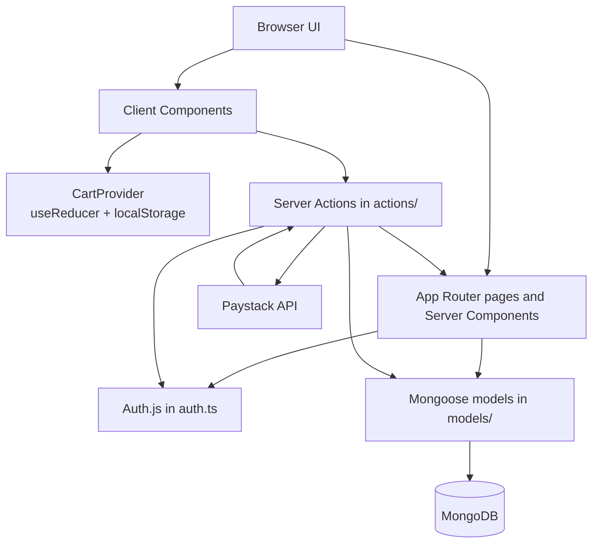

# Ember & Bean

Ember & Bean is a full-stack coffee shop application built with Next.js App Router and TypeScript. It has a public menu and ordering flow, customer accounts, authentication, and an admin area for managing the shop.

## Overview

I started this as a coffee shop application, but the more useful part became the work behind the screens. I wanted to understand what happens after someone clicks a button: how a request is authenticated, how input is checked, where server-side code runs, how MongoDB stores the result, and how the updated data gets back into the UI.

That makes this project a step beyond building frontend-only interfaces for me. It is still a learning project rather than a production system, but it gives me a place to work through the connections between components, sessions, Server Actions, Mongoose models, database queries, payment verification, and client-side state.

## What I Wanted to Learn

- How Auth.js fits into a Next.js application and how credentials, Google, and GitHub sign-in can share one authentication setup.
- How users, roles, sessions, and protected routes connect to account and admin functionality.
- What a Server Action actually does at the boundary between a browser interaction and server-side work.
- How a Server Action can validate input, connect to MongoDB, mutate a document, and trigger route revalidation without a separate REST endpoint for every in-app operation.
- How Mongoose schemas describe users, menu items, orders, and contact messages.
- Which data should be persisted on the server and which data is temporary application state in the browser.
- How TypeScript types move through cart data, checkout input, session data, form state, and component props.
- How Server Components, Client Components, Server Actions, models, and database operations fit together in an App Router project.

## Features

### Customer-facing application

- Homepage with a hero section, featured menu, testimonials, location details, and a call to action.
- Menu browsing with category filters for coffee, pastries, and cake.
- Dietary filtering for vegan, gluten-free, dairy-free, and nut-free items.
- Sorting by newest, name, price ascending, or price descending.
- Menu item detail pages with ingredients, allergens, calories, availability, serving options, related items, and comparison pricing where present.
- Cart operations for adding items, changing quantities, removing items, and keeping different hot or iced versions as separate cart lines.
- Pickup and delivery checkout options, with a KSh 150 delivery fee for delivery orders.
- Paystack payment initialization and payment verification, including an amount check before marking an order as paid.
- Registration, credentials login, Google login, GitHub login, and logout.
- Profile page with account details and the signed-in user's order history.
- Contact form with server-side validation and database-backed message storage.

### Admin application

- Protected admin dashboard at `/private/dashboard`.
- Overview statistics for today's orders, pending orders, revenue, and customers.
- Revenue, order-status, and top-item charts for dashboard data.
- Menu management: create, update, delete, and toggle availability through the menu item form.
- Order management with status changes for pending, paid, preparing, ready, completed, and cancelled orders.
- Customer list with roles, order counts, and total spending.
- Admin role updates, including a check that prevents an admin from removing their own admin access.
- Inbox for viewing contact messages, marking them as read, and deleting them.

## Tech Stack

| Technology | Purpose |
| --- | --- |
| Next.js 16 | App Router, Server Components, routing, Server Actions, and route handlers |
| React 19 | UI components and client-side interaction |
| TypeScript | Types for application data, sessions, actions, and component boundaries |
| MongoDB | Persistent application data |
| Mongoose | MongoDB connection and schemas/models |
| Auth.js (`next-auth`) | Credentials, Google, and GitHub authentication |
| bcryptjs | Password hashing during registration and password comparison at login |
| Paystack | Payment initialization and transaction verification |
| Tailwind CSS | Utility-first styling |
| shadcn/ui and Radix primitives | Reusable interface components |
| Lucide React | Icons |
| Recharts | Admin dashboard charts |
| React Context and `useReducer` | Client-side cart state and cart actions |
| Zod, React Hook Form, and related UI packages | Installed project dependencies; they are not the main pattern used by the current server actions |

## Architecture

The application keeps page-level data access on the server where possible. Public menu pages query MongoDB through Mongoose, while interactive controls such as filtering, cart updates, checkout form state, and dashboard controls run in Client Components when they need browser APIs or event handlers.



The `app/` pages that read menu, user, order, or message data can stay server-side because they do not need to access browser APIs. Components that use `localStorage`, respond to click or submit handlers, use navigation hooks, or maintain interactive state have `"use client"`. The root layout wraps the application in `CartProvider`, so cart state is available to the customer-facing UI without putting the cart itself in MongoDB.

## Authentication

Auth.js is configured in [`auth.ts`](auth.ts), and its handlers are exposed through [`app/api/auth/[...nextauth]/route.ts`](app/api/auth/%5B...nextauth%5D/route.ts).

The configured providers are:

- Credentials: looks up the user by email, selects the stored password, and compares it with `bcryptjs`.
- Google: creates a local `User` record on first sign-in when one does not already exist.
- GitHub: follows the same local-user creation path as Google.

The custom session and JWT fields include the application user ID, role, and first name. The `User` model stores `user` or `admin` roles. The registration action hashes credentials with `bcryptjs` before creating the user, and the password field is excluded from normal Mongoose queries with `select: false`.

Protected routing is handled in two places. [`proxy.ts`](proxy.ts) redirects unauthenticated users away from `/profile`, `/checkout`, and `/private/dashboard`, and redirects non-admin users away from the dashboard. The dashboard layout also checks the session and role before rendering its shell. The checkout Server Action checks for a signed-in user before creating an order.

## Server Actions

Server Actions are the part of this project where the frontend-to-backend boundary becomes concrete. A form or interactive component can call a server-defined function, and that function can authenticate the request, validate input, talk to MongoDB, call Paystack, and return a result.

The common flow is:

```text
Client or form interaction
	-> Server Action
	-> validation and application logic
	-> Mongoose query or external payment request
	-> result, redirect, or route revalidation
```

Actions currently used in the project include:

- `actions/user.ts`: registration, credentials login, Google and GitHub login, logout, profile updates, and user lookup.
- `actions/checkout.ts`: creates a pending order, initializes a Paystack transaction, and verifies the returned payment reference and amount.
- `actions/contact.ts`: validates and stores contact form submissions.
- `actions/menuAdmin.ts`: validates menu form data and creates, updates, or deletes menu items.
- `actions/orderAdmin.ts`: validates and updates order status.
- `actions/customerAdmin.ts`: updates roles and aggregates customer order counts and spending.
- `actions/inbox.ts`: marks messages as read and deletes messages.
- `actions/dashboard.ts`: aggregates dashboard statistics and chart data.

For operations inside this Next.js application, a Server Action avoids manually creating and consuming a REST endpoint when the caller is one of the application's own forms or components. That does not mean Server Actions replace APIs in general. External clients, integrations, and independently deployable services can still need an API boundary.

## Database

The connection helper in [`lib/db.ts`](lib/db.ts) calls `mongoose.connect` with `MONGO_URI`. Pages and actions call this helper before querying or mutating data.

The Mongoose models are:

- `User`: first name, last name, unique lowercase email, optional password, role, image, and OAuth provider ID. Passwords are hashed before registration and hidden from normal queries.
- `MenuItem`: name, unique slug, description, price, optional comparison price, category, serving options, dietary tags, ingredients, allergens, calories, image URL, availability, and timestamps.
- `Order`: a reference to `User`, purchased item snapshots, pickup or delivery fulfillment, contact details, subtotal, delivery fee, total, order status, and Paystack payment details.
- `contactMessage`: name, email, message, read/new status, and timestamps.

Orders reference users through `Order.user`. The purchased menu data is stored as item snapshots inside the order, including slug, name, price, quantity, and serving option. The menu and dashboard pages read from MongoDB, while the admin actions create, update, delete, or revalidate the relevant pages after mutations.

The seed script clears existing menu items and inserts the sample menu from [`scripts/seed.ts`](scripts/seed.ts). This is a development convenience and should be treated as destructive to the current menu collection.

## State Management

There are two different kinds of state in the application:

**Server state / persisted data**

Users, menu items, orders, and contact messages live in MongoDB and are read through Mongoose. Authentication state comes from Auth.js sessions. Admin mutations revalidate affected routes so server-rendered pages can read current data.

**Client state / temporary application state**

The cart is implemented in [`context/cartContext.tsx`](context/cartContext.tsx) with React Context and `useReducer`. It is hydrated from and persisted to browser `localStorage` under `ember-and-bean-cart`. This makes sense for the current flow because the cart needs immediate updates while browsing and does not need to be saved as a server record until checkout creates an order.

The current repository does **not** use Zustand, despite that being one of the technologies I initially considered for this kind of client state. Keeping the cart in a small context and reducer lets me understand the state transitions directly before adding another state-management library.

## Project Structure

```text
app/
	page.tsx                         Public homepage
	about/                           About page
	menu/                            Menu listing and item detail routes
	cart/                            Client-side cart page
	checkout/                        Checkout and payment verification
	contact/                         Contact page
	login/                           Login page
	register/                        Registration page
	profile/                         Protected account and order history
	private/dashboard/               Protected admin dashboard
		customers/                     Customer management
		inbox/                         Contact message inbox
		menu/                          Menu management
		orders/                        Order management
	api/auth/[...nextauth]/           Auth.js route handlers
actions/                           Server Actions
components/                        Shared, menu, checkout, profile, and dashboard UI
context/cartContext.tsx            Cart Context, reducer, and localStorage persistence
lib/db.ts                          Mongoose connection helper
models/                             Mongoose models and schemas
public/images/menu/                Menu image assets
scripts/seed.ts                    Development menu seeder
types/                              Shared TypeScript and Auth.js types
auth.ts                             Auth.js providers, callbacks, and session setup
proxy.ts                            Route protection and role redirects
```

## Local Development

### Requirements

- Node.js and npm
- A MongoDB connection
- OAuth credentials if Google or GitHub login is needed
- Paystack credentials if checkout and payment verification are needed

### Environment variables

The code reads the following variables:

```env
MONGO_URI=
GITHUB_CLIENT_ID=
GITHUB_CLIENT_SECRET=
GOOGLE_CLIENT_ID=
GOOGLE_CLIENT_SECRET=
PAYSTACK_SECRET_KEY=
NEXT_PUBLIC_APP_URL=http://localhost:3000
```

The OAuth callback URLs depend on the Auth.js setup and the local or deployed application URL. Add the corresponding callback URLs in the Google and GitHub provider settings. Keep secret values out of version control.

### Install and run

```bash
npm install
npm run dev
```

Open [http://localhost:3000](http://localhost:3000) in a browser.

To load the sample menu into MongoDB:

```bash
npm run db:seed
```

Available scripts:

| Command | Purpose |
| --- | --- |
| `npm run dev` | Start the Next.js development server |
| `npm run build` | Create a production build |
| `npm run start` | Start the production server |
| `npm run lint` | Run ESLint |
| `npm run db:seed` | Clear and seed the menu collection |

## Known Limitations and Future Improvements

This is a learning project, so there are deliberate boundaries and unfinished edges:

- Several admin Server Actions are called from already-protected dashboard pages but do not repeat a role check inside the action itself. Centralizing authorization in the actions would make that boundary safer.
- Checkout validates the delivery requirement and verifies the Paystack amount, but the checkout input is still relatively small and could use more complete schema validation.
- There is no automated test suite in the repository yet.
- The cart is local to the browser and is not synchronized across devices or attached to a user account before checkout.
- Payment handling currently covers transaction initialization and verification; it does not include webhook processing or a broader order/payment reconciliation workflow.

Those limitations are part of what I want to keep learning from this project: the UI is only one layer, and the interesting work is making the boundaries between the layers explicit and dependable.

First, run the development server:

```bash
npm run dev
# or
yarn dev
# or
pnpm dev
# or
bun dev
```

Open [http://localhost:3000](http://localhost:3000) with your browser to see the result.

You can start editing the page by modifying `app/page.tsx`. The page auto-updates as you edit the file.

This project uses [`next/font`](https://nextjs.org/docs/app/building-your-application/optimizing/fonts) to automatically optimize and load [Geist](https://vercel.com/font), a new font family for Vercel.

## Learn More

To learn more about Next.js, take a look at the following resources:

- [Next.js Documentation](https://nextjs.org/docs) - learn about Next.js features and API.
- [Learn Next.js](https://nextjs.org/learn) - an interactive Next.js tutorial.

You can check out [the Next.js GitHub repository](https://github.com/vercel/next.js) - your feedback and contributions are welcome!

## Deploy on Vercel

The easiest way to deploy your Next.js app is to use the [Vercel Platform](https://vercel.com/new?utm_medium=default-template&filter=next.js&utm_source=create-next-app&utm_campaign=create-next-app-readme) from the creators of Next.js.

Check out our [Next.js deployment documentation](https://nextjs.org/docs/app/building-your-application/deploying) for more details.
